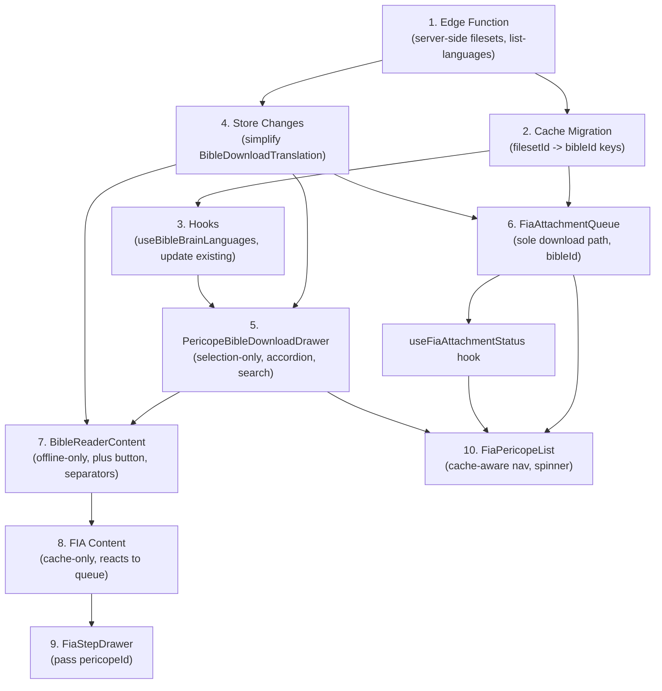

# Bible Download Feature Reimplementation

## Current State

The current code has a basic `PericopeBibleDownloadDrawer` (80% snap, flat checkbox list, single-language only), a `BibleReaderContent` with online fetching still present, and no language search or multi-language download support. The edge function only supports `list-bibles` (by single ISO) and `get-content`, and leaks fileset IDs to the client. The client stores per-testament fileset IDs and is responsible for choosing the right one -- a complexity that belongs on the server.

## What Was Designed (March 16-17 Sessions)

The sessions iterated toward a specific UX: a full-height accordion-based drawer with server-side language search, offline-only Bible reading, a plus button to add translations from the FIA drawer, language-grouped dropdowns, and per-pericope cache-aware navigation.

## Key Architectural Change: Server-Side Fileset Resolution

The Bible Brain API organizes content into "filesets" by testament (OT, NT, or complete). Today the edge function picks a fileset at `list-bibles` time (without knowing what book the user will read), sends the fileset ID to the client, and the client passes it back to `get-content`. This breaks for Bibles with separate OT/NT filesets.

**New approach:** The client never sees fileset IDs. `get-content` accepts `bibleId` + `bookId`, and the edge function resolves the correct fileset internally using `guessTestament(bookId)` + `pickBestFileset`. Cache keys change from `{filesetId}/{bookId}/{verseRange}` to `{bibleId}/{bookId}/{verseRange}`. `BibleDownloadTranslation` drops all fileset fields.

---

## 1. Edge Function: Server-Side Filesets, Language Search

**File:** `[supabase/functions/bible-brain-content/index.ts](supabase/functions/bible-brain-content/index.ts)`

### Change `get-content` to accept `bibleId` + `bookId`

Currently `get-content` takes `textFilesetId` and `audioFilesetId`. Change it to:

```typescript
interface GetContentRequest {
  action: "get-content";
  bibleId: string; // e.g. "ENGKJV"
  bookId: string; // e.g. "MRK"
  startChapter: number;
  startVerse: number;
  endChapter: number;
  endVerse: number;
}
```

The handler fetches the bible's filesets from Bible Brain (`GET /bibles/{bibleId}`), calls `pickBestFileset(filesets, TEXT_TYPES, bookId)` and `pickBestFileset(filesets, AUDIO_TYPES, bookId)` with the actual bookId, then fetches content using the resolved fileset IDs. This fixes the dual-testament bug: `guessTestament` + `TESTAMENT_SIZES` filtering stays entirely server-side.

### Change `list-bibles` -- drop fileset IDs, add iso/languageName

The response becomes:

```typescript
interface BibleEntry {
  id: string; // bible abbreviation (e.g. "ENGKJV")
  name: string;
  vname: string | null;
  hasText: boolean; // computed server-side from filesets
  hasAudio: boolean; // computed server-side from filesets
  iso: string; // ISO 639-3 code
  languageName: string; // language name from Bible Brain
}
```

No `textFilesetId`, `audioFilesetId`, or per-testament variants. The server checks filesets to set `hasText`/`hasAudio` but doesn't expose them.

### Add `list-languages` action

```typescript
interface ListLanguagesRequest {
  action: "list-languages";
  search: string; // min 2 chars
}
```

Calls Bible Brain `GET /languages/search/{search_text}`. Returns `{ languages: Array<{ iso: string; name: string; autonym: string }> }`.

## 2. Cache Migration: filesetId -> bibleId

**File:** `[utils/bible-cache.ts](utils/bible-cache.ts)`

Change the cache directory layout from `bible_cache/{filesetId}/{bookId}/{verseRange}/` to `bible_cache/{bibleId}/{bookId}/{verseRange}/`.

All functions update their signatures:

- `cacheBibleText(bibleId, bookId, verseRange, data)` (was `textFilesetId`)
- `getCachedBibleText(bibleId, bookId, verseRange)` (was `textFilesetId`)
- `isBibleTextCached(bibleId, bookId, verseRange)` (was `textFilesetId`)
- `downloadBibleAudio(bibleId, bookId, verseRange, audio)` (was `audioFilesetId`)
- `getCachedBibleAudio(bibleId, bookId, verseRange)` (was `audioFilesetId`)
- `isBibleAudioCached(bibleId, bookId, verseRange)` (was `audioFilesetId`)

Update all callers: `useBibleBrainContent`, `useBibleBookDownload`, `PericopeBibleDownloadDrawer`, `BibleReaderContent`, `FiaAttachmentQueue`, `FiaPericopeList`.

## 3. New Hooks

- `**hooks/useBibleBrainLanguages.ts` -- calls `list-languages` action with a search query (debounced, min 2 chars). Returns `{ languages, isLoading }`.
- `**hooks/useBibleBrainBiblesByIso.ts` -- calls `list-bibles` with a given ISO code. Returns `{ bibles, isLoading }`.

### Update existing hooks

- `**hooks/useBibleBrainBibles.ts` -- `BibleBrainBible` type drops fileset fields, adds `iso` and `languageName`. Returns `{ id, name, vname, hasText, hasAudio, iso, languageName }`.
- `**hooks/useBibleBrainContent.ts` -- `useBibleBrainContent(bibleId, fiaBookId, verseRange)` instead of `(textFilesetId, audioFilesetId, fiaBookId, verseRange)`. Checks cache by `bibleId`, calls `get-content` with `bibleId` + `bookId`.

All hooks use React Query with appropriate cache/stale times.

## 4. Store Changes

**File:** `[store/localStore.ts](store/localStore.ts)`

`BibleDownloadTranslation` becomes:

```typescript
interface BibleDownloadTranslation {
  bibleId: string;
  name: string;
  vname: string | null;
  hasText: boolean;
  hasAudio: boolean;
  iso: string;
  languageName: string;
}
```

No fileset IDs. The `bibleId` is the sole identifier -- the server resolves filesets when content is requested. Similarly, `bibleTranslationByProject` entries drop fileset fields.

## 5. PericopeBibleDownloadDrawer -- Complete Redesign

**File:** `[components/PericopeBibleDownloadDrawer.tsx](components/PericopeBibleDownloadDrawer.tsx)`

### Layout

- Full-height drawer: `snapPoints={['100%']}`, `enableDynamicSizing={false}`
- Fixed search bar above scroll view (not inside scroll)
- Include-audio toggle above scroll view
- Scrollable accordion body (`flex-1`)
- Fixed footer with Confirm CTA (no `border-t` separator)
- Always dismissible (no downloads to protect)

### Search

- **Use the same `Input` search bar pattern from `[views/new/NextGenProjectsView.tsx](views/new/NextGenProjectsView.tsx)` (lines 868-887):** `Input` with `prefix={SearchIcon}`, `prefixStyling={false}`, `size="sm"`, `returnKeyType="search"`, and a `suffix` that shows an `ActivityIndicator` (with `getThemeColor('primary')`) while fetching, `suffixStyling={false}`, `hitSlop={12}`.
- Server-side search via `useBibleBrainLanguages` (debounced, min 2 chars)
- While searching (query >= 2 chars), hide the source language accordion and show search results as language accordions

### Accordion Structure

- **Source language accordion** (below search bar, collapsed by default)
  - Title: actual language name from `lookupLanguoidName` (not "Project Language")
  - Contains translation checkbox rows for the source language
- **Added language accordions** (below source)
  - Each selected language gets its own accordion section
  - Title: language name
  - Contains translation checkbox rows

### Selection

- `selectedIds: Set<string>` persists across languages
- Each `TranslationCheckboxRow` shows cached status (`isBibleTextCached(bibleId, bookId, verseRange)`), text/audio badges

### Confirm Flow (No Foreground Downloads)

The drawer is **selection-only**. It never downloads content itself. On "Confirm" press:

1. Save `bibleDownloadTranslations` to the local store (with `iso`, `languageName`)
2. Set the first selected bible as the active translation (`setBibleTranslation`)
3. Close the drawer immediately
4. Call `onComplete()` so `FiaPericopeList` can proceed to quest creation / navigation

All actual downloading happens in the background via `FiaAttachmentQueue` (see section 6).

### Why This Is Better

- **No blocking UI.** The user selects translations and moves on.
- **Offline resilience.** If the network drops, `FiaAttachmentQueue` retries automatically (60s interval, `retry: true` on error). No partial state to manage in the drawer.
- **No duplicate work.** The drawer was previously doing the same downloads that `FiaAttachmentQueue.syncBibleContent` would do moments later when the quest appeared. Now there's one path.
- **Always dismissible.** No need for `dismissible={false}` since there's nothing running to protect.

## 6. Background Downloads via FiaAttachmentQueue

**File:** `[db/powersync/FiaAttachmentQueue.ts](db/powersync/FiaAttachmentQueue.ts)`

### Current Behavior

The `FiaAttachmentQueue` already watches for quests with FIA pericope IDs in metadata. When it finds one, `downloadRecord` calls `fetchAndCacheFiaPericope` for FIA guide content, then `syncBibleContent` for Bible text+audio. It has built-in retry (`syncInterval: 60_000`, `onDownloadError` returns `{ retry: true }`).

### What Changes

1. `**syncBibleContent` passes `bibleId` + `bookId` to `get-content` instead of fileset IDs. No client-side fileset resolution needed.
2. **Cache checks use `bibleId`**: `isBibleTextCached(bibleId, bookId, verseRange)` instead of `isBibleTextCached(textFilesetId, ...)`.
3. **The drawer no longer downloads anything.** The queue is now the sole download path for both FIA guide and Bible content.

### Pericope Card Loading Spinner

**File:** `[views/new/FiaPericopeList.tsx](views/new/FiaPericopeList.tsx)`

The pericope card (`PericopeButton`) needs to show a spinner while the `FiaAttachmentQueue` is processing that pericope's content. The mechanism:

- The `FiaAttachmentQueue` writes records to the `fia_attachments` SQLite table with states: `QUEUED_DOWNLOAD` -> `SYNCED` (or stays queued on retry)
- Query the `fia_attachments` table for the pericope's attachment ID and check its state
- If the record exists and `state !== SYNCED`, show a spinner on the pericope card (same `ActivityIndicator` pattern used for `isCreatingThis` on chapter cards)
- When the queue finishes and marks the record `SYNCED`, the PowerSync watch triggers a re-render and the spinner disappears

A simple `useFiaAttachmentStatus(attachmentId)` hook watches the `fia_attachments` table:

```typescript
export function useFiaAttachmentStatus(attachmentId: string): boolean {
  const result = usePowerSyncWatchedQuery(
    `SELECT state FROM fia_attachments WHERE id = ? LIMIT 1`,
    [attachmentId],
  );
  const state = result.data?.[0]?.state;
  return state !== undefined && state !== AttachmentState.SYNCED;
}
```

### What Happens When the User Taps a Downloading Pericope

If the user taps a pericope while it's still downloading (spinner visible), the `checkBibleAndNavigate` flow runs. Since content isn't cached yet, the download drawer opens -- but it shows translations already saved in the store. The user can close the drawer and wait, or the card spinner makes it clear content is still being fetched.

## 7. BibleReaderContent -- Offline Only

**File:** `[components/BibleReaderContent.tsx](components/BibleReaderContent.tsx)`

### Remove Online Functionality

- Remove `TranslationDownloadToggle` entirely
- Remove online fetching path from the content display -- only show cached content
- Remove "Connect to the internet" messaging; instead show "Download this translation from the Bible download drawer"
- Remove `useNetworkStatus` dependency

### Add Plus Button

- Add a "+" button next to the `TranslationPicker` dropdown
- Opens `PericopeBibleDownloadDrawer` when pressed
- Requires new `pericopeId` prop to pass through

### Language Separators in Dropdown

- Group translations by language in the dropdown
- Add `isSeparator` field to `DropdownItem`
- Show language section headers when multiple languages exist (from `bibleDownloadTranslations` which now has `iso`/`languageName`)

### New Props

```typescript
interface BibleReaderContentProps {
  projectId: string | undefined;
  fiaBookId: string | undefined;
  verseRange: string | undefined;
  pericopeId?: string; // new -- for download drawer
}
```

### Only Show Downloaded Translations

- Source the translation list from `bibleDownloadTranslations[projectId]` in the local store, not from the API
- This means only downloaded translations appear in the picker

## 8. FIA Content -- Offline Only

### `hooks/useFiaPericopeSteps.ts`

- Remove the online fallback (`fetchAndCacheFiaPericope`) from the query function. Since Bible + FIA content is now always downloaded in the background via `FiaAttachmentQueue`, the hook should only read from cache:

```typescript
queryFn: async () => {
  if (!projectId || !pericopeId) return null;
  return await getCachedFiaPericope(pericopeId);
},
```

- Keep the `fia_attachments` watcher (invalidates query when attachment queue finishes syncing). This is now the primary way the UI reacts to background downloads completing -- the query re-runs when the cache file appears.
- If cache returns `null`, show a loading/waiting state (not an error) since the attachment queue may still be processing. The `useFiaAttachmentStatus` hook can differentiate "still downloading" from "genuinely missing."

### `hooks/useFiaPericopeText.ts`

- Delete this file entirely -- it is unused (nothing imports it). Dead code.

## 9. FiaStepDrawer -- Pass pericopeId

**File:** `[components/FiaStepDrawer.tsx](components/FiaStepDrawer.tsx)`

- Pass `pericopeId` through to `BibleReaderContent`:

```tsx
<BibleReaderContent
  projectId={projectId}
  fiaBookId={fiaBookId}
  verseRange={verseRange}
  pericopeId={pericopeId}
/>
```

## 10. FiaPericopeList -- Fix Re-Download Prompt Bug

**File:** `[views/new/FiaPericopeList.tsx](views/new/FiaPericopeList.tsx)`

### The Problem

When a user taps a pericope they have already downloaded Bible translations and FIA guide content for, the `PericopeBibleDownloadDrawer` pops up again asking them to download. This happens because `checkBibleAndNavigate` only checks whether `savedDownloads` (the project-level translation preferences) exist, but does not verify whether the **actual cached content** for that specific pericope is already on disk.

The result: every time a user revisits a pericope -- even one they set up minutes ago -- they get blocked by the download drawer. This makes the flow feel broken and repetitive.

### How It Should Work

The download drawer should only appear for pericopes where content is **not yet cached**. The `checkBibleAndNavigate` function needs a two-layer check:

1. **FIA guide cached?** -- `isFiaPericopeCached(pericope.id)` checks if `fia_attachments/{pericopeId}/response.json` exists on disk
2. **Bible text cached for all saved translations?** -- For each translation in `savedDownloads`, call `isBibleTextCached(bibleId, bookId, verseRange)`

If both are true, skip the drawer entirely and navigate straight to the quest. If either is missing, show the download drawer as normal.

### Implementation

```typescript
const checkBibleAndNavigate = (questId, questName, questData, pericope) => {
  if (isFiaPericopeCached(pericope.id) && savedDownloads.length > 0) {
    const bookId = book.id.toUpperCase();
    const allCached = savedDownloads.every((b) =>
      isBibleTextCached(b.bibleId, bookId, pericope.verseRange),
    );
    if (allCached) {
      goToQuest({
        id: questId,
        project_id: projectId,
        name: questName,
        projectData: project as Record<string, unknown>,
        questData,
      });
      return;
    }
  }
  setPendingNav({ questId, questName, questData, pericope });
};
```

This also means the drawer's "save translations on confirm" behavior (section 5) is critical -- the project-level `bibleDownloadTranslations` must be written to the store immediately so that the `FiaAttachmentQueue` knows which translations to download, and subsequent pericopes can reference them for cache checks.

---

## Dependency Order


