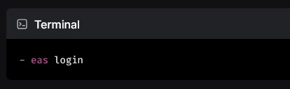
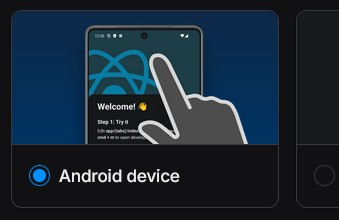
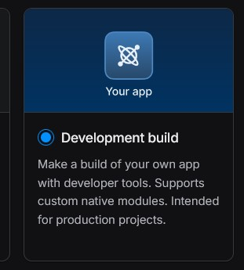
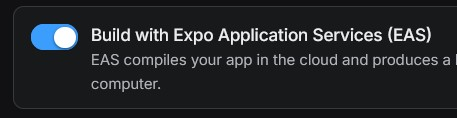
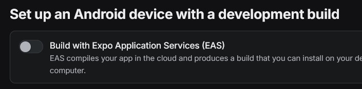

# LangQuest

Internal mobile app for collaborative language translation.

## Getting set up

1. Clone repository:

```bash
git clone https://github.com/eten-genesis/langquest.git
```

2. Switch to the dev branch:

```bash
git checkout dev
```

3. Install dependencies:

```bash
npm i
```

4. **To obtain the .env file**, request an invite from an existing admin developer to the existing eten-genesis expo organization (secrets required the the APK build to be built in EAS are in the organization)
  

Obtain the .env file by logging into EAS and running the `eas env:pull <production|preview|development>` command, and change the newly created `.env.local` file to `.env`.

5. If you're using a physical android device, enable USB debugging before connecting to your machine:

   - Go to Settings > About phone
   - Tap "Build number" seven times to become a developer
   - Return to Settings > System > Developer options
   - Enable "USB debugging"

6. Run the app by following the [Expo environment setup guide](https://docs.expo.dev/get-started/set-up-your-environment/) for your platform, **with the supplemental pointers below**:

- Recommended to run on physical android device (emulator may have minimal limitations but should allow for most functionality)



- Choose **Development build** (not Expo Go)



### There are two ways to run the app:

#### 1. EAS Development Build (`eas build --platform android --profile development`)



- Creates a standalone development **APK**
- Can be installed and run without computer connection
- Includes development tools but packaged as installable app
- Builds in Expo's cloud infrastructure (no local SDK needed)
- Takes longer to build but can be shared with team members
- Requires EAS account and configuration

- To see the console log output from the APK, run

```bash
adb logcat --pid=$(adb shell pidof -s com.etengenesis.langquest)
```

#### 2. Local Development (`npm run android`)



- Runs the app directly on your connected Android device/emulator
- Enables real-time code updates (hot reload)
- Requires USB connection or local network connection
- Includes development tools and debugging features
- Faster build times for testing changes
- Requires local Android SDK setup

## Local Development Environment

> To disable the local environment and use the cloud environment instead, delete your `.env.local` file.

### Prerequisites

- Download [Docker Desktop](https://www.docker.com/get-started) (docker compose version 4.24.0 or greater required)

### Running Local Services

- Run this command to run your local dev environment (Cmd/Ctrl+C to stop or run `npm run env:stop`):

  ```bash
  npm run env
  ```

- In another terminal, run the app as normal:

  ```bash
  npm run android
  ```

- Run this command **if necessary** to reset your local dev environment (please make sure its running first):

  ```bash
  npm run env:clean
  ```

### Usage

#### Making Database Changes

1. Access the Supabase Studio at [http://localhost:54323](http://localhost:54323).

2. Modify tables & columns in the Table Editor and/or SQL Editor.

   > For **any new database tables** you create, make sure to toggle its 'powersync' [publication](http://localhost:54323/project/default/database/publications) before diffing database changes, so that PowerSync can replicate the tables.

3. Update the local drizzle schema in `db/drizzleSchema.ts` to reflect the changes you made.

4. Generate a migration file with a descriptive name to describe your changes:

   ```bash
   npx supabase@beta db diff -f "your_migration_description"
   ```

   > This creates a timestamped SQL migration file in the `supabase/migrations` directory

   - For **any new database tables** you create, add a publication statement for each new table, to the end of the new migration file that was just created [(hopefully this will be automatic at some point)](https://github.com/supabase/cli/issues/883):

     ```sql
     alter publication "powersync" add table only "<schema>"."<table_name>";
     ```

5. (Optional) If you want to preserve any test data you've inserted across database resets (recommended if adding new tables or columns), run this command to save your local database's current data:

   ```bash
   npx supabase@beta db dump --local --schema public --data-only > supabase/seeds/public.sql
   ```

   This creates a SQL file containing all the data from your local database's public schema, which will be automatically loaded when you reset your database using `npm run env:clean`.

6. Review the generated migration file to ensure it captures your intended changes.

7. Commit the migration file to your repository to track database schema changes.

> **Note**: If you need to repair the migration history table to match local migration files (for example, if migrations appear as reverted when they shouldn't be), you can run:
> ```bash
> npx supabase@beta migration repair --status reverted --local
> ```
> This will prompt you to confirm repairing the entire migration history table to match your local migration files.

#### Making Sync Rule Changes

1. Edit the sync rules configuration in `/supabase/config/sync_rules.yml`.

> If your local environment is running already, PowerSync will auto restart when you make changes to the sync rules. Otherwise just start the environment and changes will be reflected accordingly.

### Common issue during setup:

```bash
Execution failed for task ':app:processDebugMainManifest'.
> Manifest merger failed : uses-sdk:minSdkVersion 23 cannot be smaller than version 24 declared in library [:journeyapps_react-native-quick-sqlite]
```

To resolve this:

1. Delete package-lock.json and node_modules folder
2. Remove root android folder
3. Run `npm i`
4. Run `npx expo prebuild --clean` to regenerate the android folder with correct configuration
5. Try building the app again
